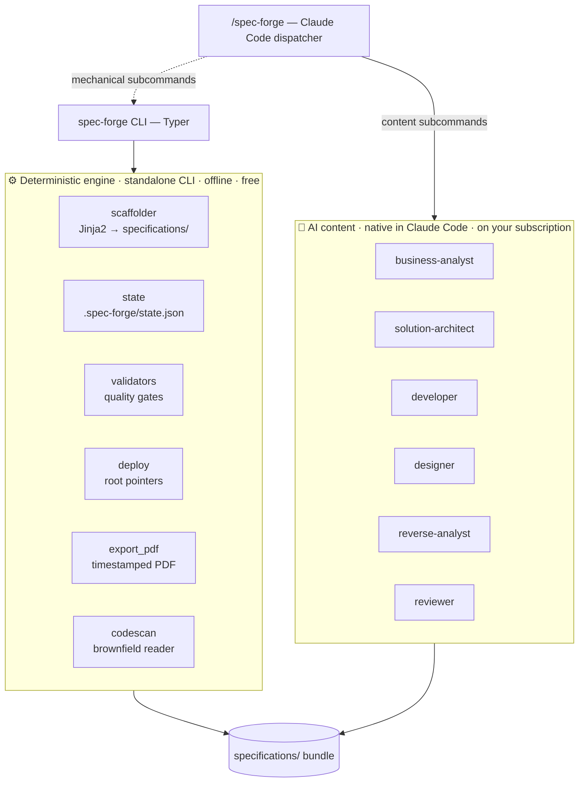
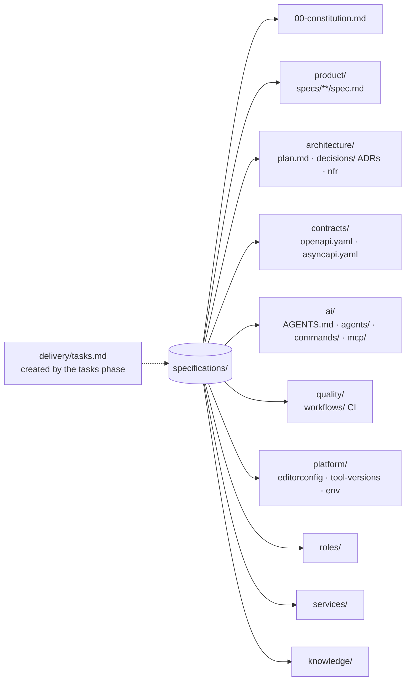
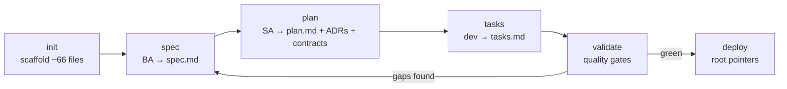
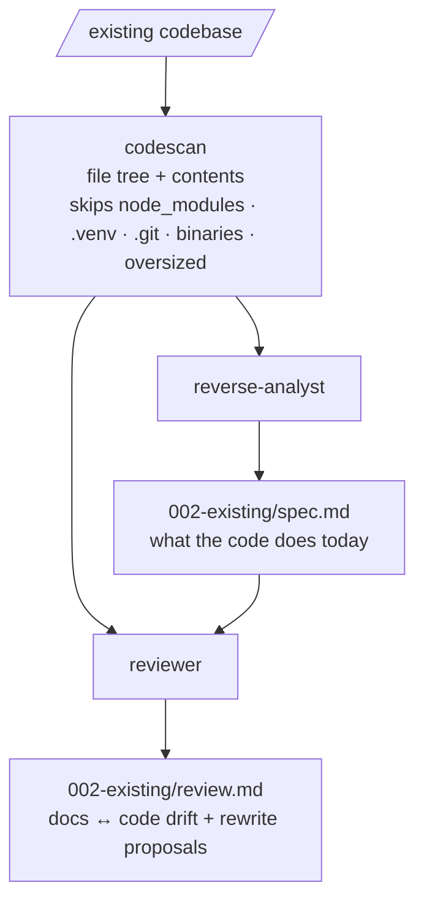
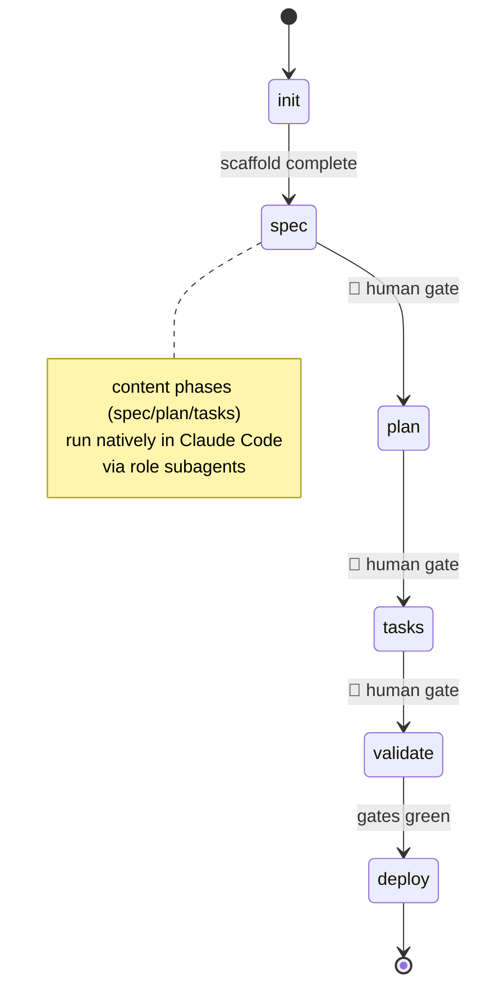
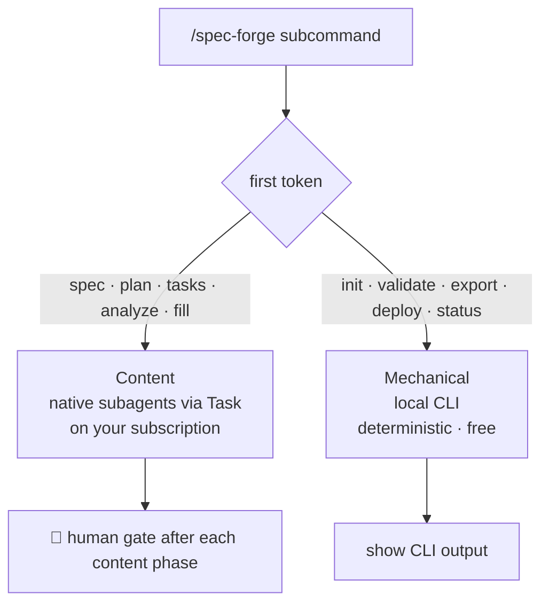
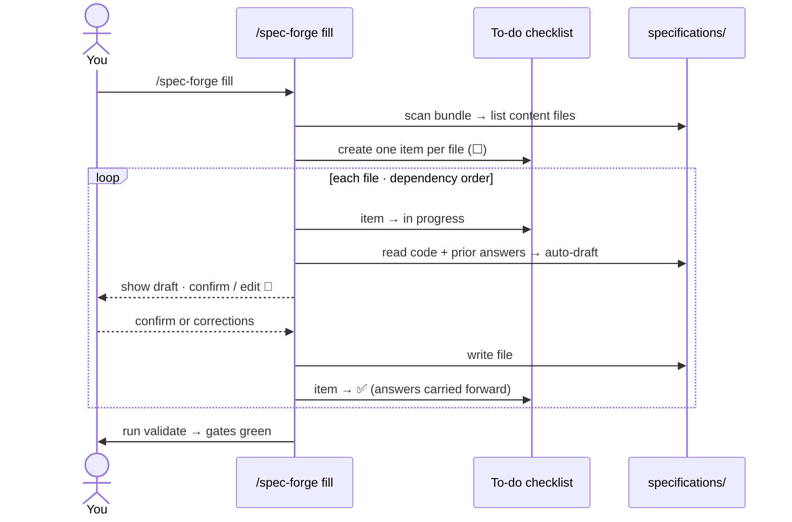
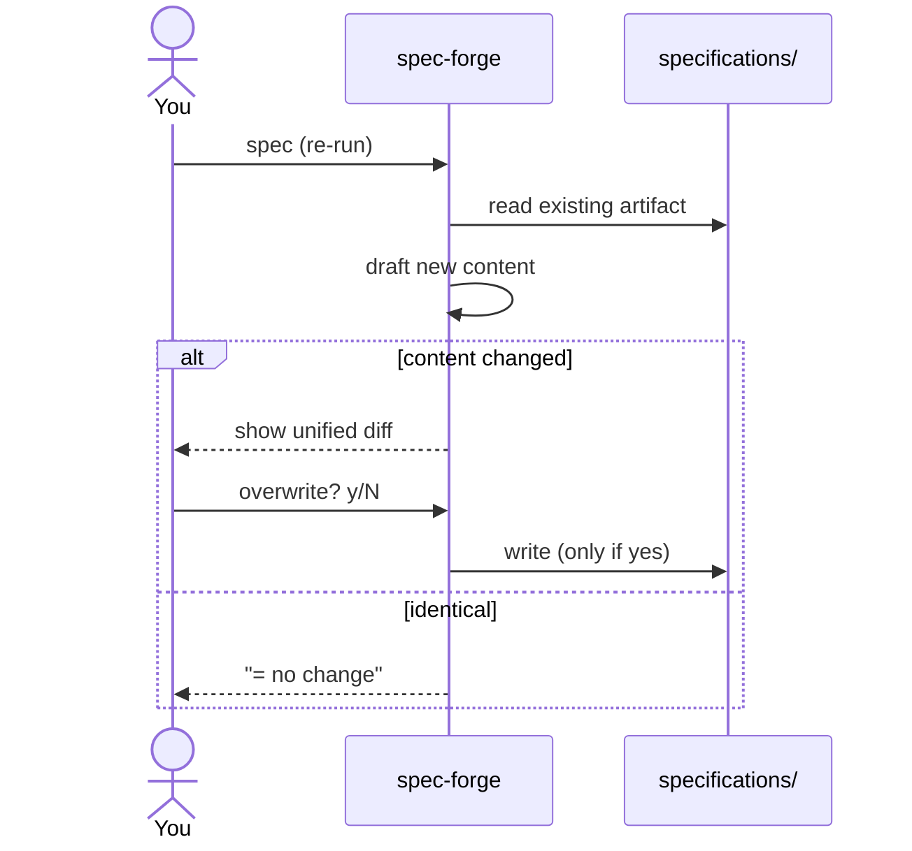
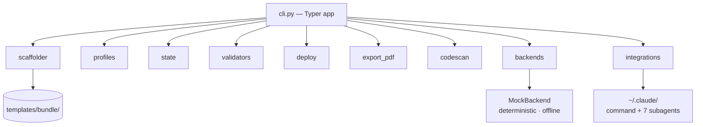

# spec-forge

**Stack-agnostic, spec-driven development CLI.** Turn any project — greenfield or existing — into a
complete, portable, **AI- & OS-friendly `specifications/` bundle**: the source of truth *before* code.

spec-forge is a **hybrid**: a deterministic engine does the boring, must-be-reproducible work
(scaffolding, lifecycle, validation, PDF export, tool-discovery), while **AI role subagents** (BA / SA /
Designer / Developer + reverse-analyst / reviewer) fill the *content* — **natively inside Claude Code, on
your subscription**. No paid backend: the standalone CLI is fully offline and free; the
real drafting happens through the `/spec-forge` slash command.

> `Python 3.12+` · `Typer` · `uv` · `Jinja2` · `pydantic` · `fpdf2` · `pytest` + `Ruff` · 49 passing tests

---

## Table of contents

- [The idea in one picture](#the-idea-in-one-picture)
- [What you get — the `specifications/` bundle](#what-you-get--the-specifications-bundle)
- [Two modes: greenfield & brownfield](#two-modes-greenfield--brownfield)
- [Install](#install)
- [Command reference](#command-reference)
- [Lifecycle & state](#lifecycle--state)
- [Claude Code integration — the `/spec-forge` dispatcher](#claude-code-integration--the-spec-forge-dispatcher)
- [Guided `fill` wizard](#guided-fill-wizard)
- [Brownfield: `analyze` in depth](#brownfield-analyze-in-depth)
- [Quality gates](#quality-gates)
- [Stack profiles](#stack-profiles)
- [Tool-discovery deploy](#tool-discovery-deploy)
- [Re-spec — safe updates](#re-spec--safe-updates)
- [Under the hood — module map](#under-the-hood--module-map)
- [Configuration](#configuration)
- [Develop](#develop)
- [Design decisions](#design-decisions)

---

## The idea in one picture

Two lanes produce one artifact. The **deterministic engine** (left) runs from the standalone CLI —
offline, reproducible, free. The **AI content lane** (right) runs natively in Claude Code through role
subagents. Both write into the same `specifications/` bundle.



**Why hybrid?** The structure of a spec bundle must be byte-identical on every machine (so it diffs
cleanly and survives CI). That's a job for deterministic code. The *judgement* — what the requirements
are, which trade-offs to make — is a job for an LLM. spec-forge draws the line exactly there.

---

## What you get — the `specifications/` bundle

The single deliverable is a **`specifications/` bundle** — a complete, portable spec for your project.
`init` scaffolds the skeleton (**~66 starter files**, byte-for-byte deterministic); each phase then
fills a key artifact through a role subagent.



Each artifact has an owner:

| Role subagent | Command | Deliverable |
|---|---|---|
| `business-analyst` | `/spec-forge spec` | `product/specs/001-feature/spec.md` — requirements in **EARS / Given-When-Then**, testable user stories (P1 = MVP), **measurable** success criteria (`SC-…`), glossary |
| `solution-architect` | `/spec-forge plan` | `architecture/plan.md` + **ADRs** in `architecture/decisions/` + contracts `contracts/openapi.yaml` (+ `asyncapi.yaml` if needed) + NFRs in numbers |
| `designer` | *(optional)* | `design/<feature>.design.md` — user flows, component states, a11y |
| `developer` | `/spec-forge tasks` | `delivery/tasks.md` — atomic, traceable tasks with checkboxes |
| `reverse-analyst` | `/spec-forge analyze` | `product/specs/002-existing/spec.md` — the **actual** spec of existing code, with file citations |
| `reviewer` | `/spec-forge analyze` | `product/specs/002-existing/review.md` — **docs-vs-code audit**: gaps, drift, and concrete rewrite proposals |

Deterministic (free) subcommands round it out: **`deploy`** writes ~14 root pointers for tool discovery,
**`validate`** runs the quality gates, **`status`** shows lifecycle progress, and **`export`** bundles
every spec file into a single timestamped PDF for team review.

---

## Two modes: greenfield & brownfield

### Greenfield — build the spec from scratch



```bash
spec-forge init  ./my-app --name "My App" --stack python
spec-forge spec  ./my-app -d "what to build"    # then /spec-forge spec  in Claude Code
spec-forge plan  ./my-app                        # then /spec-forge plan
spec-forge tasks ./my-app                        # then /spec-forge tasks
spec-forge validate ./my-app
spec-forge deploy   ./my-app
```

### Brownfield — reverse-engineer + audit an existing project

`analyze` never touches your code. It reverse-engineers what the code *does today*, then audits your
docs *against* that code — flagging drift and proposing rewrites.



```bash
spec-forge analyze /path/to/existing-project      # → 002-existing/spec.md + review.md
```

---

## Install

Installs the global CLI **and** registers the `/spec-forge` Claude Code command in one step:

```bash
curl -fsSL https://raw.githubusercontent.com/chiperi/spec-forge/main/install.sh | bash
# or from a clone:   just install     (same as ./install.sh)
```

Remove **both** together:

```bash
./uninstall.sh          # or:  just uninstall
```

- **Upgrade:** re-run the installer (or `uv tool upgrade spec-forge`). The `/spec-forge` command
  self-upgrades on the next CLI run.
- If `spec-forge` isn't found, put `~/.local/bin` on `PATH` (`uv tool update-shell`).

<details><summary>Raw uv (CLI only)</summary>

```bash
uv tool install git+https://github.com/chiperi/spec-forge.git
```

The `/spec-forge` wrapper and its 7 subagents are then auto-registered on first run — see
[Claude Code integration](#claude-code-integration--the-spec-forge-dispatcher).
</details>

<details><summary>From source (develop)</summary>

```bash
git clone https://github.com/chiperi/spec-forge.git
cd spec-forge
uv sync
uv run spec-forge --help
```
</details>

---

## Command reference

Every command takes a project directory (default `.`). Content commands additionally have a native
counterpart in Claude Code (`/spec-forge <cmd>`) that produces *real* AI content instead of deterministic
scaffolding.

| Command | Purpose | Key flags | Precondition |
|---|---|---|---|
| `init <dir>` | Scaffold the `specifications/` bundle (~66 files) | `--name` · `--stack {python,node,go}` · `--summary` · `--yes/-y` | dir has no `specifications/` yet |
| `spec <dir>` | **BA** → `product/specs/001-feature/spec.md` | `--description/-d` · `--yes` | `init` done |
| `plan <dir>` | **SA** → `architecture/plan.md` | `--yes` | a `spec.md` exists |
| `tasks <dir>` | **Developer** → `delivery/tasks.md` | `--yes` | `plan.md` exists |
| `analyze <src>` | Brownfield reverse spec + docs-vs-code review | `--path` · `--slug` (`002-existing`) · `--only {both,spec,review}` · `--max-file-bytes` (`100000`) · `--max-chars` (`200000`) · `--yes` | `src` is a directory |
| `validate <dir>` | Run quality gates (exit 1 on failure) | — | — |
| `deploy <dir>` | Write root pointers for tool discovery | — | bundle exists |
| `export <dir>` | Single timestamped PDF of the whole bundle | `--out` (`exports`) | bundle exists |
| `status <dir>` | Show lifecycle progress | — | — |
| `command install` | (Re)install `/spec-forge` + 7 subagents | `--project` · `--force` | — |
| `command uninstall` | Remove `/spec-forge` + subagents | `--project` | — |

`--yes/-y` skips the re-spec confirmation prompt (for CI). See [Re-spec](#re-spec--safe-updates).

---

## Lifecycle & state

Lifecycle state lives in **`.spec-forge/state.json`** at the project root — *outside* the bundle, so it
never affects scaffold determinism. It powers `status` and the re-spec diff/confirm flow. There's a
**human gate** after every content phase.



```bash
spec-forge status ./my-app
# ✅ init
# ✅ spec
# ⬜ plan
# → next phase: plan
```

---

## Claude Code integration — the `/spec-forge` dispatcher

On first CLI run (idempotent), spec-forge registers a Claude Code slash command **and 7 role subagents**
under `~/.claude/`:

`business-analyst` · `solution-architect` · `developer` · `designer` · `code-reviewer` ·
`reverse-analyst` · `reviewer`.

`/spec-forge` is a **dispatcher over the exact CLI subcommands** — the first token routes to one of two
classes:



- **Content** subcommands (`spec`, `plan`, `tasks`, `analyze`, `fill`) are generated **natively in Claude
  Code** by delegating to a role subagent — no CLI call, on your subscription.
- **Mechanical** subcommands (`init`, `validate`, `export`, `deploy`, `status`) shell out to the local
  `spec-forge` CLI and show its output.

| Subcommand | What runs |
|---|---|
| `/spec-forge spec [desc]` | **native** → `business-analyst` → `product/specs/001-feature/spec.md` |
| `/spec-forge plan` | **native** → `solution-architect` → `plan.md` + ADRs + contracts |
| `/spec-forge tasks` | **native** → `developer` → `delivery/tasks.md` |
| `/spec-forge analyze [dir]` | **native** → `reverse-analyst` + `reviewer` → `002-existing/` |
| `/spec-forge fill` | **native wizard** — step through every `specifications/` file (auto-draft → confirm) with a live to-do checklist |
| `/spec-forge init · validate · export · deploy · status` | runs the local **CLI** (deterministic, free) |

**Housekeeping**

- Install / refresh: `spec-forge command install [--project] [--force]` · remove: `spec-forge command uninstall`.
- The command **self-upgrades** by a version marker (`<!-- spec-forge-command vN -->`) on the next CLI
  run. Subagent files are **create-if-missing** — use `command install --force` to refresh them after an
  upgrade.
- Opt out of auto-registration: `export SPEC_FORGE_NO_SLASH=1`.
- Reload Claude Code after install to see `/spec-forge`.

> Python/uv has no uninstall hooks, so `uv tool uninstall` can't auto-remove the command — run
> `spec-forge command uninstall`.

---

## Guided `fill` wizard

`/spec-forge fill` walks the **entire** `specifications/` bundle one file at a time. For each content
file it **auto-drafts** from your code plus everything you confirmed on previous steps, then stops for
your review; a **live to-do checklist** (the task panel) tracks filled vs pending. Deterministic config
files are marked *scaffolded (skip)*. Native-only — the terminal CLI can't render the checklist.



Order: `00-constitution.md` → `product/specs/**/spec.md` → `plan.md` → `decisions/` → `contracts/` →
`nfr.md` → `tasks.md` → `design/` → `roles/` → `knowledge/` → `README`. Each answer feeds the next step,
so the wizard never asks the same thing twice.

---

## Brownfield: `analyze` in depth

`analyze` is the brownfield entry point. It reads your code (bounded, offline), then produces two docs
under `product/specs/<slug>/` — **without modifying a single source file**.

**1 · `codescan` — the bounded reader.** A deterministic, offline walk of the target:

- skips service dirs (`.git`, `node_modules`, `.venv`, `dist`, `build`, `__pycache__`, `target`,
  `.next`, … and the tool's own `specifications/`, `exports/`);
- skips binaries, symlinks, oversized files (`--max-file-bytes`), and secrets (`.env*`, `.DS_Store`);
- builds a **file tree + file contents** within a character budget (`--max-chars`), truncating the tail
  with an explicit note.

**2 · `reverse-analyst` → `spec.md`.** Infers the *factual* spec — what the project does today, entry
points, behavior (EARS / Given-When-Then), data model, dependencies, invariants — **citing file paths**
for every claim, and marking guesses `[NEEDS CLARIFICATION]`.

**3 · `reviewer` → `review.md`.** Audits the **docs in `specifications/` against the current code**:

- per-doc table: **Covered / Missing / Stale-drift / Incorrect** (with the source file in code);
- **drift** — where the code changed but the docs lagged (quotes both sides);
- for each discrepancy, a **concrete doc-rewrite proposal** (what to write, in which section) — *proposed,
  not applied* (human gate);
- a verdict on whether the docs match the code.

```bash
spec-forge analyze /path/to/proj                       # both docs
spec-forge analyze /path/to/proj --only review         # just the drift audit
spec-forge analyze /path/to/proj --path ./out --slug legacy
```

> The standalone CLI scaffolds deterministically (the `mock` backend echoes the scanned context). The
> **real** reverse-engineering and audit run natively via `/spec-forge analyze` in Claude Code, on your
> subscription.

---

## Quality gates

`validate` runs three deterministic gates (no AI). Any failure exits non-zero (CI-friendly).

| Gate | Passes when |
|---|---|
| `structure` | required files exist (`ai/AGENTS.md`, `architecture/plan.md`) **and** at least one `product/specs/**/spec.md` |
| `clarifications` | **zero** open `[NEEDS CLARIFICATION]` markers across all spec files |
| `measurable-success` | every spec has a `Success Criteria` section with measurable `SC-…` items |

```bash
spec-forge validate ./my-app
# ✅ structure
# ❌ clarifications
#    - product/specs/001-feature/spec.md: 2 open [NEEDS CLARIFICATION]
# ✅ measurable-success
```

---

## Stack profiles

The bundle output is **stack-agnostic** — the target stack is a pluggable profile, never hardcoded in
the engine (`--stack` at `init`).

| Profile | Runtime | Linter | Formatter | Test | `.tool-versions` |
|---|---|---|---|---|---|
| `python` | Python 3.12+ | ruff | ruff format | pytest | `python 3.12.0` |
| `node` | Node 20+ | biome | biome format | vitest | `nodejs 20.11.0` |
| `go` | Go 1.22+ | golangci-lint | gofmt | go test | `golang 1.22.0` |

Adding a profile is a pure data change (`StackProfile`) — no core edits (FR-007).

---

## Tool-discovery deploy

`deploy` materializes root-level pointers so editors, agents and CI discover the single source in
`specifications/`. It only creates pointers whose targets actually exist.

| Kind | Root name → target |
|---|---|
| **Symlink** | `AGENTS.md`, `CLAUDE.md` → `specifications/ai/AGENTS.md` |
| **Symlink** | `.mcp.json` → `ai/mcp/mcp.json` · `.editorconfig` → `platform/editorconfig` · `.tool-versions` → `platform/tool-versions` · `.env.example` → `platform/env.example` |
| **Real copy** | `.gitattributes` → `platform/gitattributes` *(git reads it with `O_NOFOLLOW`, so it must be a real file, not a symlink)* |
| **Nested symlink** | `.claude/{agents,commands,skills,hooks,settings.json}` · `.github/copilot-instructions.md` · `.github/workflows` |

---

## Re-spec — safe updates

Re-running a content phase never blind-overwrites. If the new draft differs from the file on disk, you
get a **unified diff** and a confirmation prompt (skip with `--yes`).



---

## Under the hood — module map



| Module | Responsibility |
|---|---|
| `cli.py` | Typer commands, flags, prompts, re-spec diff/confirm |
| `scaffolder.py` | Jinja2 render of `templates/bundle/` → `specifications/`; **sorted traversal → byte-identical output** |
| `profiles.py` | `StackProfile` seam (python/node/go) |
| `models.py` | pydantic `InterviewAnswers`, `Phase` |
| `state.py` | lifecycle state (`.spec-forge/state.json`), phase order |
| `validators.py` | the three quality gates |
| `codescan.py` | bounded, deterministic brownfield code reader |
| `backends.py` | `AIBackend` seam; `MockBackend` (echo) is the only backend — real content is native in Claude Code |
| `deploy.py` | root pointers (symlinks + git-safe copies) |
| `export_pdf.py` | single timestamped PDF (fpdf2 + embedded fonts, emoji fallback) |
| `integrations.py` | registers `/spec-forge` + subagents; version self-upgrade |

**Determinism guarantee:** same inputs → byte-identical bundle (sorted file walk, no timestamps/random in
the scaffold), verified in CI across a Linux/macOS/Windows matrix.

---

## Configuration

| Variable | Effect |
|---|---|
| `SPEC_FORGE_NO_SLASH=1` | Skip auto-registration of the `/spec-forge` command on CLI run |

---

## Develop

```bash
uv sync
uv run spec-forge --help
uv run ruff check .
uv run ruff format .
uv run pytest --cov=spec_forge
```

- **Ruff** for lint + format; type hints required.
- The engine core is deterministic and unit-tested; no hardcoded stack in the core.
- Determinism is checked in CI (same inputs → identical output), on a per-OS matrix.

---

## Design decisions

This tool's own requirements live in [`specifications/`](specifications/) — written with its own
spec-driven process (**dogfooding**). Key choices are recorded as ADRs in
[`specifications/architecture/decisions/`](specifications/architecture/decisions/):

- **ADR-0001** — app-first hybrid (deterministic engine + AI subagents).
- **ADR-0003** — single-PDF export.
- **ADR-0004** — Claude Code slash integration.
- **ADR-0005** — brownfield `analyze` (bounded reader + reverse spec + review).
- **ADR-0006** — native `/spec-forge` dispatcher over exact subcommands (on your subscription).
