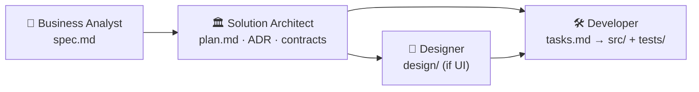
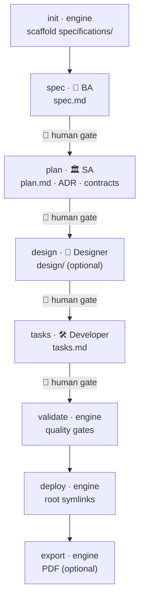

# spec-forge

**Stack-agnostic, spec-driven documentation generator.** Turns any project into a complete,
**AI- & OS-friendly** specification bundle (`specifications/`). A hybrid: a **deterministic engine**
(scaffolding · lifecycle · validation) + **AI personas** (BA / SA / Designer / Developer) that fill in
the content. After every content phase there is a **human gate** — you review the artifact, then move on.

> This README is a practical guide: **roles → functionality → rules → a full step-by-step cycle** on one
> example project. The tool's own internals live in [`specifications/`](specifications/).

## Contents

1. [Roles (personas)](#1-roles-personas)
2. [Functionality (commands = phases)](#2-functionality-commands--phases)
3. [Install](#3-install-one-time)
4. [General usage rules](#4-general-usage-rules)
5. [Full cycle, step by step](#5-full-cycle-step-by-step-example-notes-api)
6. [Two content backends](#6-two-content-backends)
7. [Brownfield: docs from existing code](#7-brownfield-docs-from-existing-code)

---

## 1. Roles (personas)

Each document phase is owned by one persona. A persona is both a guide for a human and an AI subagent
(`specifications/ai/agents/*.md`). The key part of each is its **boundaries** — what the role does **not**
do, so it never sprawls.

| Persona | Active when | Owns / produces | Does not do |
|---|---|---|---|
| 👤 **Business Analyst** | feature start — WHAT / WHY | `product/specs/*/spec.md`, glossary | pick the stack, write code |
| 🏛️ **Solution Architect** | after spec.md — HOW | `architecture/plan.md`, ADRs `decisions/`, `contracts/`, NFRs, threat model | write prod code, design UI |
| 🎨 **Designer** | features with a UI | `design/` — flows, states, design system, a11y | define backend/DB, write code |
| 🛠️ **Developer** | after plan/tasks | `delivery/tasks.md`, then `src/` + `tests/` | scope creep, silent refactors |
| 🔎 **code-reviewer** | after code | review for bugs / simplifications | — |
| ↩️ **reverse-analyst** | brownfield analysis | reverse `spec.md` from existing code | invent missing features |
| 📋 **reviewer** | brownfield analysis | `review.md` — gap / review doc | rewrite the code |

**Handoff along the chain:**



---

## 2. Functionality (commands = phases)

`spec-forge` is a CLI built around lifecycle phases. Content phases are run by a persona; mechanical phases
by the deterministic engine.

| Command | Phase | Runs | Input → Output |
|---|---|---|---|
| `init` | scaffold | engine (no AI) | folder → `specifications/` skeleton for the stack |
| `spec` | requirements | 👤 BA | description → `product/specs/001-feature/spec.md` |
| `plan` | architecture | 🏛️ SA | `spec.md` → `architecture/plan.md` + ADRs + contracts |
| `tasks` | work plan | 🛠️ Developer | `plan.md` → `delivery/tasks.md` (atomic tasks) |
| `validate` | quality gates | engine (no AI) | bundle → pass/fail per gate |
| `deploy` | tool-discovery | engine (no AI) | bundle → root symlinks (`AGENTS.md`, `.claude/…`) |
| `export` | PDF snapshot | engine (no AI) | bundle → `exports/spec-forge-export-<ts>.pdf` |
| `analyze` | brownfield | ↩️ reverse-analyst + 📋 reviewer | existing code → `spec.md` + `review.md` |
| `status` | progress | engine | state → done / next phase |

All artifacts land in a single `specifications/` tree (layers: `product/` · `architecture/` · `contracts/`
· `design/` · `delivery/` · `quality/` · `platform/` · `ai/` · `roles/` · `knowledge/`).

---

## 3. Install (one-time)

```bash
curl -fsSL https://raw.githubusercontent.com/chiperi/spec-forge/main/install.sh | bash
```

Installs the global CLI **and** registers the `/spec-forge` Claude Code command + 7 role subagents.
Remove both together: `./uninstall.sh` (or `spec-forge command uninstall`). Reload Claude Code to see `/spec-forge`.

---

## 4. General usage rules

- **Fixed phase order:** `init → spec → plan → tasks → validate → deploy`. Each phase reads the previous one's artifact.
- **Human gate after every content phase** — review and approve the artifact before running the next one.
- **`[NEEDS CLARIFICATION]` blocks progress.** Open questions in `spec.md` hold the pipeline until closed.
- **Idempotent + re-spec.** Re-running a phase never duplicates artifacts: it shows a **diff** and asks before overwriting (manual edits are preserved). `--yes` / `-y` skips the confirmation (for CI).
- **Two content backends** (see §6): native Claude Code (no API key) or CLI `--backend claude`.
- **Stack-agnostic.** The stack is chosen at `init` (`--stack python|node|go`) — the core never changes.
- **Guardrails:** never commit secrets/`.env`; don't edit the bundle structure by hand; no "while I'm here" refactors.

---

## 5. Full cycle, step by step (example: `notes-api`)

We build documentation from scratch for one project — a notes REST API. Each step shows both entry points:
🟢 **in Claude Code** (`/spec-forge …`, on your subscription, no API key) and ⚙️ **CLI** (`--backend claude`, needs `ANTHROPIC_API_KEY`).

The full pipeline:



### Step 0 — project folder
```bash
mkdir notes-api && cd notes-api
```

### Step 1 — `init`: the `specifications/` skeleton
Deterministic scaffold for the stack (no AI). This is a mechanical phase — in Claude Code it is delegated to the same local CLI.
```bash
⚙️  spec-forge init . --name "notes-api" --stack python   # flags
    spec-forge init .                                      # or interactive interview (name, stack)
🟢  /spec-forge init                                       # same CLI, from Claude Code
```
**Result:** a full `specifications/` tree with all layers + `.spec-forge/state.json`. → `status`: `✅ init`.

### Step 2 — `spec` (👤 BA): requirements
```bash
⚙️  spec-forge spec . -d "REST API for notes with tags and full-text search" --backend claude
🟢  /spec-forge spec REST API for notes with tags and full-text search
```
**Result:** `product/specs/001-feature/spec.md` — problem, user stories, acceptance (EARS / Given-When-Then), **measurable** success criteria (SC-…), glossary.
**🚦 Gate:** read spec.md; close every `[NEEDS CLARIFICATION]`.

### Step 3 — `plan` (🏛️ SA): architecture
```bash
⚙️  spec-forge plan . --backend claude
🟢  /spec-forge plan
```
**Input:** `spec.md`. **Result:** `architecture/plan.md` + ADRs (`decisions/`) + contracts (`openapi.yaml`) + NFRs in numbers + threat model.
**🚦 Gate:** approve the plan and key decisions (ADRs).

### Step 4 — `design` (🎨 Designer) — *optional, if there is a UI*
For a pure API you can skip it. For a UI — user flows, component states, a11y (WCAG AA) in `design/`.

### Step 5 — `tasks` (🛠️ Developer): work plan
```bash
⚙️  spec-forge tasks . --backend claude
🟢  /spec-forge tasks
```
**Input:** `plan.md`. **Result:** `delivery/tasks.md` — **atomic, traceable** tasks with checkboxes: id `T-001`, `[P]` marker (parallelizable), links to `US-/FR-/NFR-`.
**🚦 Gate:** make sure the tasks cover every requirement.

### Step 6 — `validate`: quality gates
```bash
spec-forge validate .            # same in both backends (no AI)
```
Runs 3 deterministic gates (exits `1` if any is red):

| Gate | Checks |
|---|---|
| `structure` | `ai/AGENTS.md`, `architecture/plan.md`, ≥1 `spec.md` exist |
| `clarifications` | **0** open `[NEEDS CLARIFICATION]` |
| `measurable-success` | spec.md has `Success Criteria` with `SC-` markers |

### Step 7 — `deploy`: expose for tools
```bash
spec-forge deploy .
```
Places **symlinks** in the project root pointing at the source of truth in `specifications/` (`AGENTS.md`,
`CLAUDE.md`, `.mcp.json`, `.claude/*`, dotfiles), so Claude/Cursor/Copilot find configs at standard paths.

### Step 8 — `export` (optional): PDF for team review
```bash
spec-forge export .              # → exports/spec-forge-export-<timestamp>.pdf
```

### Check progress anytime
```bash
spec-forge status .
# ✅ init  ✅ spec  ✅ plan  ✅ tasks  ✅ validate  ✅ deploy  → all phases done
```

**Cycle recap:** `init → spec(BA) → plan(SA) → [design] → tasks(Dev) → validate → deploy` — spec first, then architecture, then the work plan; a human gate between phases.

---

## 6. Two content backends

| | 🟢 Claude Code (native) | ⚙️ CLI |
|---|---|---|
| Invocation | `/spec-forge <subcommand>` | `spec-forge <subcommand> --backend claude` |
| Key | **not needed** (subscription) | needs `ANTHROPIC_API_KEY` |
| Model | subagents inside Claude Code | Anthropic Messages API, `claude-opus-4-8` |
| Mechanical (`init`/`validate`/`export`/`deploy`/`status`) | delegated to the local CLI | local CLI |

The default `--backend mock` is offline and deterministic (echo scaffold, no AI) — handy for tests/CI.

---

## 7. Brownfield: docs from existing code

If the code already exists — reconstruct the spec and get a review, **without touching the code**:
```bash
spec-forge analyze /path/to/project --backend claude
# → product/specs/002-existing/spec.md    (what it does today)
# → product/specs/002-existing/review.md   (what/where to fix, severity)
```

---

## Develop the tool (from source)

```bash
git clone https://github.com/chiperi/spec-forge.git && cd spec-forge
uv sync
uv run spec-forge --help
uv run ruff check . && uv run pytest --cov=spec_forge
```

The tool's own requirements were written with its own spec-driven process (dogfooding) — see [`specifications/`](specifications/).
