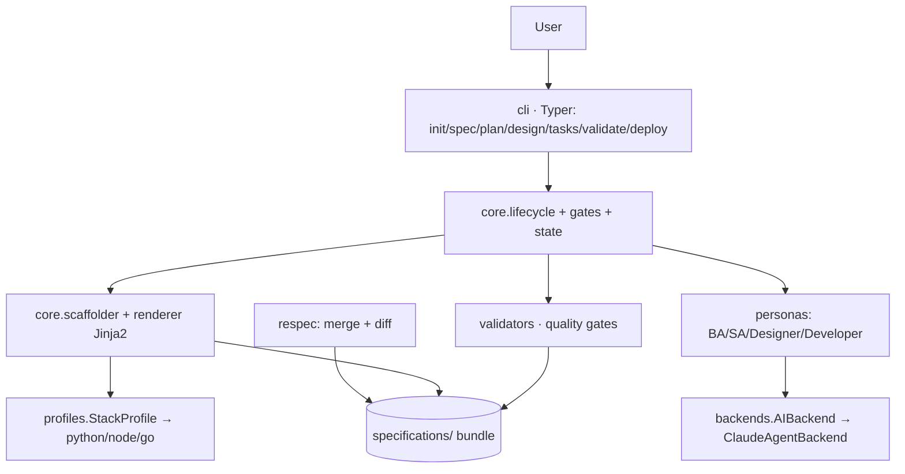

# Technical Plan: spec-forge

**Based on:** `../product/specs/001-spec-generation/spec.md`
**Created:** 2026-07-09
**Status:** Draft
**Author:** SA (solution-architect persona)

> ЯК будуємо. Рішення-розвилки → `decisions/` (ADR).

## 1. Огляд рішення
App-first **гібрид**: детермінований CLI-двигун (Python/Typer) + AI-субагенти (нативно в Claude Code)
для наповнення. Фазовий lifecycle з людськими гейтами. Вихід — bundle `specifications/`.
Незалежність від стеку — через підключувані **stack-profiles**.

## 2. Архітектурний стиль
**Modular monolith** (один CLI-процес, модулі з контрактними межами). Не мікросервіси — це локальний
інструмент, розподіл зайвий; але `backends` і `profiles` спроєктовані як **seams** (інтерфейси) для
майбутньої заміни. Деталі → [ADR-0001](decisions/0001-app-first-hybrid.md).

## 3. Стек
Python 3.12+ · **Typer** (CLI) · **uv** · **Ruff** · **pytest** · **Jinja2** (рендер шаблонів) ·
**pydantic** (моделі/валідація) · **нативні субагенти Claude Code** (AI-наповнення) + `MockBackend`
(детермінований CLI-скафолдинг) · Rich (вивід/diff, опційно).

## 4. Архітектура (модулі)

- **cli/** — команди Typer (флаги + інтерактивні prompt-и, FR-011).
- **core/lifecycle** — стан фаз, людські гейти (FR-009).
- **core/scaffolder + renderer** — детермінований рендер шаблонів у bundle (FR-001).
- **core/state** — персист стану фаз (`.spec-forge/state.json` у цільовому проєкті).
- **personas/** — BA/SA/Designer/Developer: обгортки промптів, що кличуть backend (FR-003/004).
- **backends/** — `AIBackend` interface + `ClaudeAgentBackend` (seam, FR-010).
- **profiles/** — `StackProfile` interface + python/node/go (seam, FR-007).
- **validators/** — quality gates: повнота, вимірювані NFR, відкриті clarification, лінт контрактів (FR-006).
- **respec/** — merge + diff для оновлення (FR-012, US-8).
- **templates/** — вбудований bundle-шаблон (наш `specifications/`).

## 5. Модель даних (pydantic)
`Project` · `StackProfile` · `PhaseState(enum + status)` · `Artifact(path, kind, status)` ·
`ValidationResult(gate, passed, gaps[])` · `InterviewAnswers` · `AIBackend(abstract)`.
Стан життєвого циклу зберігається у `.spec-forge/state.json`.

## 6. Інтерфейси / контракти
- **CLI-контракт** — команди + флаги (це «API» тула). OpenAPI/AsyncAPI **не застосовні** (це CLI,
  не сервіс) — свідоме рішення; контрактом слугують сигнатури команд і Python-інтерфейси.
- `AIBackend.draft(persona, context) -> str`
- `StackProfile.files() -> dict[path,str]` · `StackProfile.commands() -> dict[str,str]`
- `Validator.check(bundle) -> ValidationResult`

## 7. Cross-cutting concerns
- **Детермінізм** (NFR-002/003): рендер без `now()`/random; сортовані ключі; фіксований порядок обходу → байтова ідентичність.
- **Ідемпотентність** (NFR-004): повторний запуск не псує; re-spec іде через diff-підтвердження.
- **Помилки:** явні exit codes; блокери на гейтах зупиняють lifecycle.
- **Безпека** (NFR-007): не логувати вміст промптів із секретами; не комітати `.env`; AI-виклики лише з дозволу.
- **Логи:** structured, `--verbose`.

## 8. Тестова стратегія
- **Unit** — scaffolder/renderer/validators/profiles (детерміновані).
- **Golden tests** — `init` з фіксованими входами → порівняння з еталонним bundle (SC-002/005).
- **Contract tests** — кожен StackProfile/Backend/Validator відповідає своєму інтерфейсу (NFR-005).
- **AI-фази** — мок `AIBackend` у детермінованих тестах; окремі опційні live-smoke.
- **CI-matrix** — ubuntu/macos/windows (NFR-002).

## 9. Ризики
- LLM-варіативність у фазах наповнення → мітигація: строгі промпти + валідатори + людський гейт.
- Складність re-spec merge → почати з diff + ручне підтвердження, без авто-merge.

## 10. Наступне (SA-артефакти, не в цьому інкременті)
- `threat-model.md` (STRIDE — обмежено для локального CLI: секрети, виконання команд профілів).
- `observability.md` (для CLI — здебільшого logs + exit codes).
- `traceability-matrix.md` — засіється на фазі tasks.
