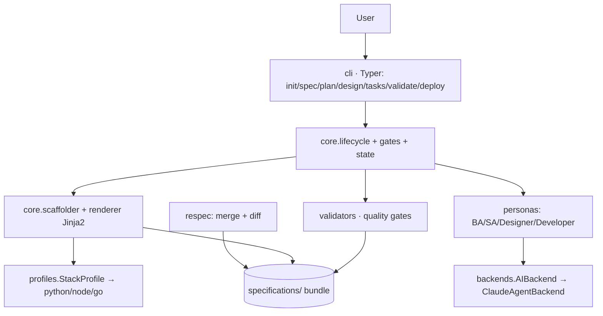

# Technical Plan: spec-forge

**Based on:** `../product/specs/001-spec-generation/spec.md`
**Created:** 2026-07-09
**Status:** Draft
**Author:** SA (solution-architect persona)

> HOW we build it. Decision forks → `decisions/` (ADR).

## 1. Solution overview
App-first **hybrid**: a deterministic CLI engine (Python/Typer) + AI subagents (natively in Claude Code)
for content. A phased lifecycle with human gates. The output is the `specifications/` bundle.
Stack independence is achieved through pluggable **stack-profiles**.

## 2. Architectural style
**Modular monolith** (a single CLI process, modules with contractual boundaries). Not microservices — this is a local
tool, so distribution is unnecessary; but `backends` and `profiles` are designed as **seams** (interfaces) for
future replacement. Details → [ADR-0001](decisions/0001-app-first-hybrid.md).

## 3. Stack
Python 3.12+ · **Typer** (CLI) · **uv** · **Ruff** · **pytest** · **Jinja2** (template rendering) ·
**pydantic** (models/validation) · **native Claude Code subagents** (AI content) + `MockBackend`
(deterministic CLI scaffolding) · Rich (output/diff, optional).

## 4. Architecture (modules)

- **cli/** — Typer commands (flags + interactive prompts, FR-011).
- **core/lifecycle** — phase state, human gates (FR-009).
- **core/scaffolder + renderer** — deterministic rendering of templates into the bundle (FR-001).
- **core/state** — persistence of phase state (`.spec-forge/state.json` in the target project).
- **personas/** — BA/SA/Designer/Developer: prompt wrappers that call the backend (FR-003/004).
- **backends/** — `AIBackend` interface + `ClaudeAgentBackend` (seam, FR-010).
- **profiles/** — `StackProfile` interface + python/node/go (seam, FR-007).
- **validators/** — quality gates: completeness, measurable NFRs, open clarifications, contract linting (FR-006).
- **respec/** — merge + diff for updates (FR-012, US-8).
- **templates/** — the built-in bundle template (our `specifications/`).

## 5. Data model (pydantic)
`Project` · `StackProfile` · `PhaseState(enum + status)` · `Artifact(path, kind, status)` ·
`ValidationResult(gate, passed, gaps[])` · `InterviewAnswers` · `AIBackend(abstract)`.
The lifecycle state is stored in `.spec-forge/state.json`.

## 6. Interfaces / contracts
- **CLI contract** — commands + flags (this is the tool's "API"). OpenAPI/AsyncAPI are **not applicable** (this is a CLI,
  not a service) — a deliberate decision; the command signatures and Python interfaces serve as the contract.
- `AIBackend.draft(persona, context) -> str`
- `StackProfile.files() -> dict[path,str]` · `StackProfile.commands() -> dict[str,str]`
- `Validator.check(bundle) -> ValidationResult`

## 7. Cross-cutting concerns
- **Determinism** (NFR-002/003): rendering without `now()`/random; sorted keys; fixed traversal order → byte-for-byte identity.
- **Idempotency** (NFR-004): a repeat run does no damage; re-spec goes through diff confirmation.
- **Errors:** explicit exit codes; blockers at gates halt the lifecycle.
- **Security** (NFR-007): do not log prompt content containing secrets; do not commit `.env`; AI calls only with permission.
- **Logs:** structured, `--verbose`.

## 8. Test strategy
- **Unit** — scaffolder/renderer/validators/profiles (deterministic).
- **Golden tests** — `init` with fixed inputs → comparison against a reference bundle (SC-002/005).
- **Contract tests** — each StackProfile/Backend/Validator conforms to its interface (NFR-005).
- **AI phases** — mock `AIBackend` in deterministic tests; separate optional live-smoke.
- **CI matrix** — ubuntu/macos/windows (NFR-002).

## 9. Risks
- LLM variability in content phases → mitigation: strict prompts + validators + human gate.
- Complexity of re-spec merge → start with diff + manual confirmation, without auto-merge.

## 10. Next (SA artifacts, not in this increment)
- `threat-model.md` (STRIDE — limited for a local CLI: secrets, execution of profile commands).
- `observability.md` (for a CLI — mostly logs + exit codes).
- `traceability-matrix.md` — seeded during the tasks phase.
